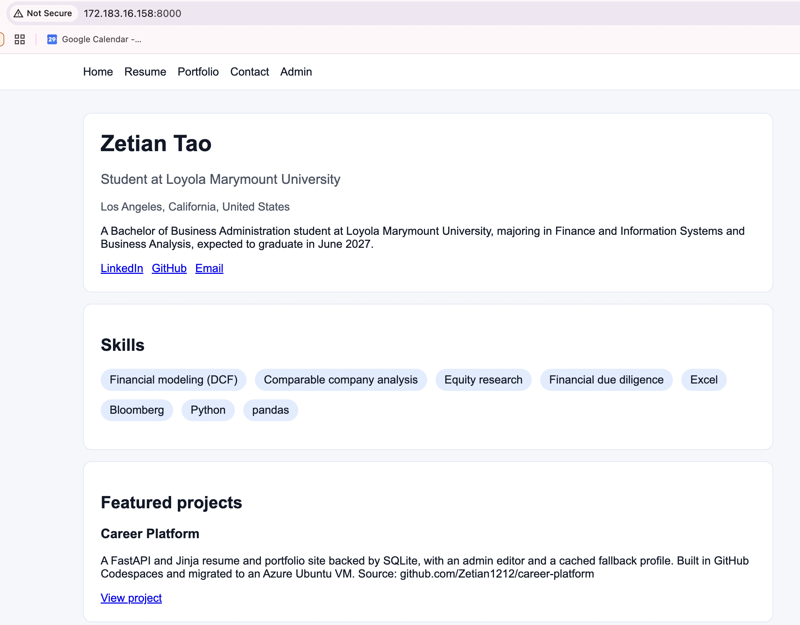

# Exercise 03 evidence: resume site migrated to an Azure VM

## 1. The VM

| Field | Value |
|---|---|
| Name | `vm-career-platform` |
| Resource group | `rg-career-platform` |
| Region | North Central US (`northcentralus`) |
| Size | `Standard_B2ats_v2` (2 vCPU, 1 GiB) |
| Image | Ubuntu Server 24.04 LTS, x64 Gen2 |
| Public IP | `172.183.16.158` |

Full step-by-step record: [`docs/superpowers/plans/2026-09-24-azure-vm-migration.md`](../superpowers/plans/2026-09-24-azure-vm-migration.md).

## 2. The site on the public IP

My own browser at `http://172.183.16.158:8000`, showing Chrome's "Not Secure" warning for plain HTTP. The page shows my profile from the VM's database, not the "Demo Candidate" fallback. It could only load while both locks were open: `Temp-HTTP-8000` allowed port 8000 in Azure, and uvicorn listened on `0.0.0.0:8000` on the VM. Afterwards the rule was deleted, and uvicorn went back to `127.0.0.1:8000`.

## 3. What went wrong, how I investigated, and what confirmed the fix

The VM in my professor's migration guide couldn't be created. An "Allowed resource deployment regions" policy on the Azure for Students subscription restricts deployments to five regions (mexicocentral, belgiumcentral, northcentralus, francecentral, swedencentral), and az vm list-skus showed the guide's Standard_B2ts_v2 in West US 2 as NotAvailableForSubscription. Claude Code found this through the Azure CLI, then compared prices from the Azure Retail Prices API for every unrestricted x64 Gen2 B-series size in the five allowed regions and picked Standard_B2ats_v2 in North Central US, the cheapest at about $0.0094 per hour, with the same 2 vCPU and 1 GiB but an AMD CPU.

The plan said to install packages with uv sync from a lock file, but the repo had no lock file, only requirements.txt. I created pyproject.toml and uv.lock from it with uv add -r requirements.txt. Then the tests failed because the python-multipart package was missing. The admin forms need it (FastAPI uses it to read form input), but it was never listed as a dependency, so this bug existed before the migration. Claude detected this and added python-multipart, pinned Python to 3.12 to match the VM's Ubuntu 24.04, and committed the lock file. All 10 tests passed on the laptop, and again on the VM after uv sync --locked.

The migrated database was empty. The site showed the fallback profile "Demo Candidate" and a banner saying the database was unavailable. I checked the database file on the laptop, on the VM, and a fresh download from the Codespace: all three were identical (same SHA-256), and every table had 0 rows. The data was never saved into the file that was committed. The banner was also misleading: the database was reachable but had nothing in it. Claude filled in my profile and a project through the site's /admin pages on the VM, then added my LinkedIn details (3 internships, 2 schools, 5 certifications, links). After that, the database returned "Zetian Tao", the page heading matched, the banner was gone, and /portfolio showed the project. Since the fallback and the seed script only knew "Demo Candidate", seeing my name proves the site is reading from the real database.

The agent took four steps I hadn't approved. It generated a random ADMIN_PASSWORD instead of letting me choose one, added python-multipart and .python-version to the lock-file commit, filled my profile with placeholder text before I had real content, and rebased its commit onto mine after a push was rejected because I'd uploaded a file through GitHub's website. All worked, but none were in the plan.

## 4. The change

Azure's firewall allows only SSH (port 22) connections from my IP address at LMU. At the coffee shop my public IP address would be different and thus the firewall rule I set up would drop my packets before reaching the VM. On the other hand, if nothing was listening on the port, then once my packets made it through the firewall the VM would just reject the packets and I would receive a refused connection.
